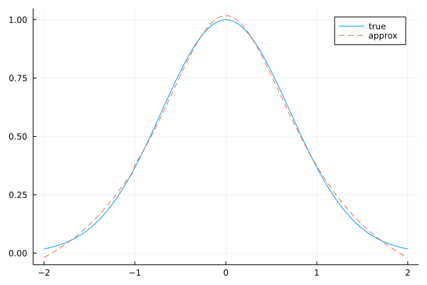

# RationalApproximations.jl
A (tiny) library for finding rational approximations to arbitrary functions,
using nonlinear least squares!

## Installation
In a Julia REPL, type

```julia-repl
julia>]add https://github.com/angeris/RationalApproximations.jl
```

## Example usage
To approximate the function `exp(-x^2)` in the range `[-2, 2]` with degree-three
polynomials in the numerator and denominator, you can write:
```julia
using RationalApproximations

x = range(-2, 2, length=100)
f(x) = exp(-x^2)

poly = fit(x, f.(x), 3, 3)

f(.5)
# 0.7788007830714049
value(.5, poly)
# 0.7616562869126146
```

You can, of course, plot the approximation against the true value:



(If you want better approximations, use higher degrees! ;)